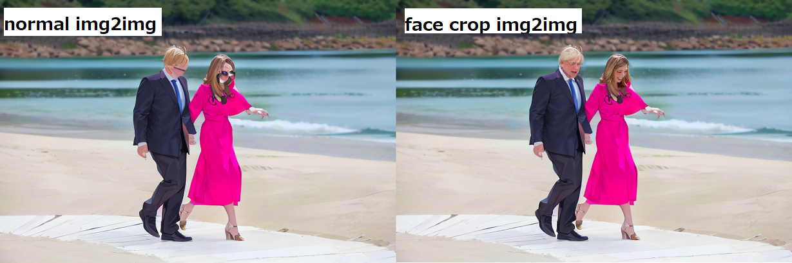
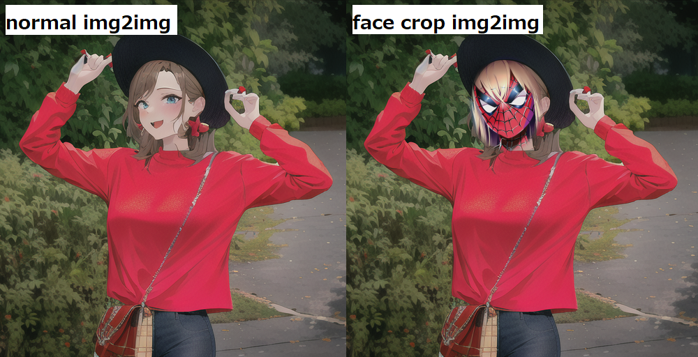

# face_crop_img2img

## Overview
#### AUTOMATIC1111 UI custom script
#### Separate the area near the face from the rest of the face and img2img with different "Denoising Strength" settings

## Example

#### img2img for Small Face Picture

#### Large Denoising Strength(0.7) for Face

#### Prompt for Face( face close up, spiderman )

## Installation
- Use the Extensions tab of the webui to [Install from URL]

## Usage
- Go to img2img and load your base image
- Choose "face crop img2img" from the scripts select
- Adjust "Face Denoising Strength"
- Generate

## Options
- "Max Crop Size" ... Maximum size of the face to be cropped. If the detected face is large, ignore it.
- "Face Denoising Strength" ... "Denoising Strength" applied to the face
- "Face Area Magnification" ... Size recognized as around the face. Magnification from the area that the face detection method considers to be a face.
- "Enable Face Prompt" ... Enable individual prompt to face
