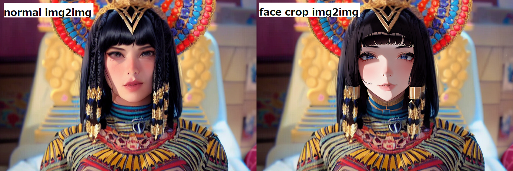

# face_crop_img2img

## Overview
#### AUTOMATIC1111 UI custom script
#### Separate the area near the face from the rest of the face and img2img with different "Denoise Strength" settings

## Example

#### img2img for Small Face Picture

#### Large Denoise Strength(0.7) for Face

## Installation
Place face_crop_img2img.py into /YOUR_SD_FOLDER/scripts

## Usage
- Go to img2img and load your base image
- Choose "face crop img2img" from the scripts select
- Adjust "Face Denoise Strength"
- Generate

## Options
- "Max Crop Size" ... Maximum size of the face to be cropped
- "Face Denoise Strength" ... "Denoise Strength" applied to the face
- "Face Area" ... Size recognized as around the face

